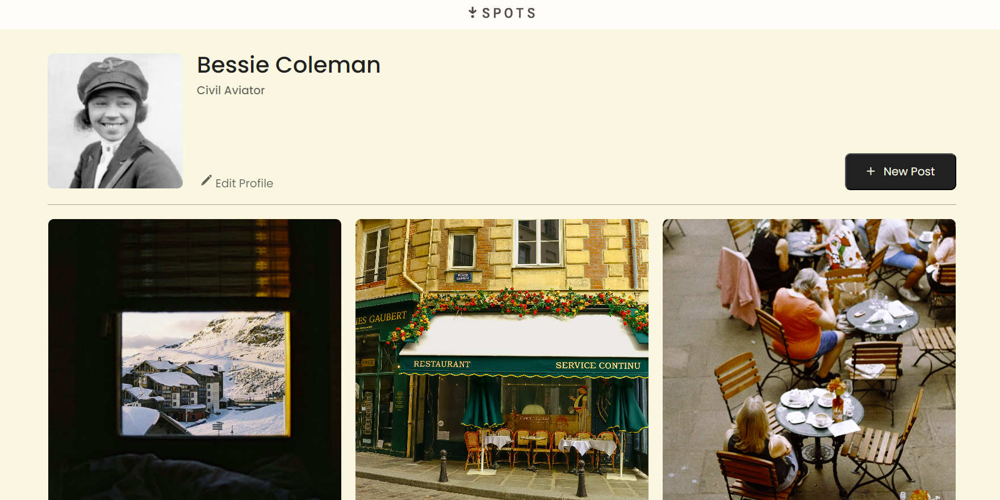
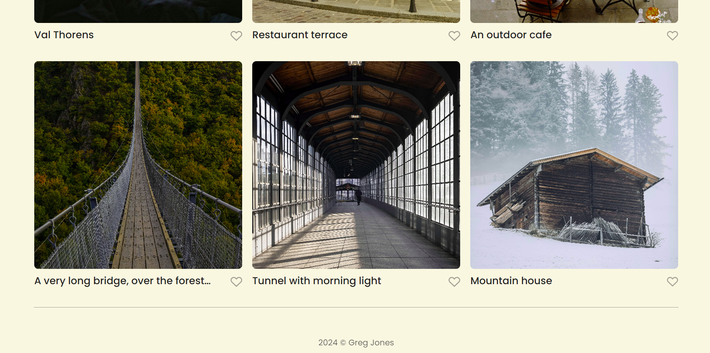

# Project 3: Spots

### Overview

- Intro
- Figma
- Images
- Tech Used
- Video Describing Project
- Deployment

**Intro**

This is the 4th project for the Triple Ten Software Enginerring program. It's associated with Sprint 3: Adaptive Web Design and Working with Layouts. For this project, we were given an adaptive web design through figma.com and we were told to replicate the web page from scratch using HTML and CSS.

Spots is an image sharing website. There is a user profile with an avatar and a grid of photographs with a short description.

This project is our first project to use responsive design where the screen changes as it gets smaller or bigger.

**Figma**

- [Link to the project on Figma](https://www.figma.com/file/BBNm2bC3lj8QQMHlnqRsga/Sprint-3-Project-%E2%80%94-Spots?type=design&node-id=2%3A60&mode=design&t=afgNFybdorZO6cQo-1)

**Images**

Here are two screenshots of the project (that look like they could be just one screenshot):

 

 

 

**Tech Used**

- HTML
- CSS
- Resposive Design
- BEM
- Grid
- Flexbox
- Hover Elements

**Video Describing Project**

https://www.loom.com/share/fc87072b3f2f472b9f1fb6020a2819cf?sid=b4de1fc1-f7f0-4407-95b4-a8810fe82c37

The text of this video can be found in the video-script.txt file provided.

**Deployment**

This webpage is deployed to GitHub Pages

-Deployment Link: https://gjone124.github.io/se_project_spots/
