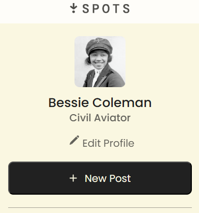

# Project 3: Spots

### Overview

- Intro
- Figma
- Images
- Tech Used
- Video Describing Project
- Deployment

**Intro**

This is the 4th project for the Triple Ten Software Engineering program. It's associated with Sprint 3, 4, 5, 6, and 9.

For the 1st stage of the project in Sprint 3 (Adaptive Web Design and Working with Layouts), we were given an adaptive web design through figma.com and we were told to replicate the web page from scratch using HTML and CSS.

Spots is an image sharing website. There is a user profile with an avatar and a grid of photographs with a short description.

This project is our first project to use responsive design where the screen changes as it gets smaller or bigger.

**Figma**

- [Link to the project on Figma for Stage 1 (Sprint 3)](https://www.figma.com/file/BBNm2bC3lj8QQMHlnqRsga/Sprint-3-Project-%E2%80%94-Spots?type=design&node-id=2%3A60&mode=design&t=afgNFybdorZO6cQo-1)

- [Link to the project on Figma for Stage 2 (Sprint 4)](https://www.figma.com/design/GfXsvCPiLqITbrVOr7odwc/Sprint-4-Project%3A-Spots?node-id=0-1&t=tQN5JrnznqQ4Wa4c-0)

**Images**

Here are two sets of screenshots of the project (at 2 different screen resolutions):

1440 pixels width (large laptop version) (2 combined screenshots):

320 pixels width (small mobile version) (5 combined screenshots):

**Tech Used**

- HTML
- CSS
- Resposive Design
- BEM
- Grid
- Flexbox
- Hover Elements

**Video Describing Project**

https://www.loom.com/share/fc87072b3f2f472b9f1fb6020a2819cf?sid=b4de1fc1-f7f0-4407-95b4-a8810fe82c37

The text of this video can be found in the video-script.txt file provided.

**Deployment**

This webpage is deployed to GitHub Pages

-Deployment Link: https://gjone124.github.io/se_project_spots/
